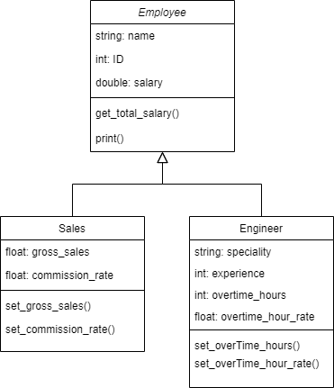

# Cpp-with-OOP
C++ with OOP projects to help me practice the concepts.

## UML of the project


## Concepts used
* Inheritance
* Abstract class
* Virtual and pure Virtual function
* Reusability
* Function overridding
* Constructor overloading (default & parameterized)
* Polymorphism using pointer to base class

### Output of main
```
Name= Ali ,ID= 16760 ,Salary= 15000
Speciality= Embedded ,Experience= 1 ,Overtime hours= 2 ,Overtime hour rate= 100
Total Salary= 15200

Name= Omar ,ID= 2412 ,Salary= 16000
Gross Sales = 1000 ,Commission Rate= 0.1
Total Salary= 16100
```