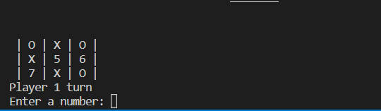

# Tic-Tac-Toe
Creating the tic tac toe game using C & C++ language

## Demo
### Game Play

### Invalid Place/Number

### Place is ALready Taken

### Game ends with a winner

### Game ends with draw

